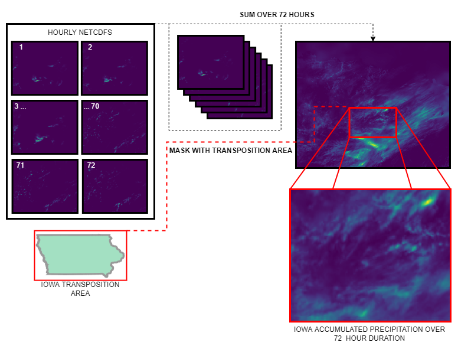
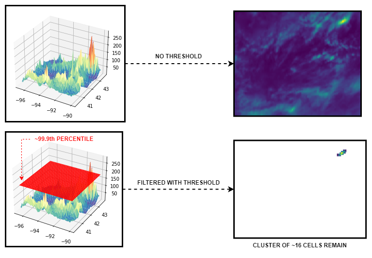
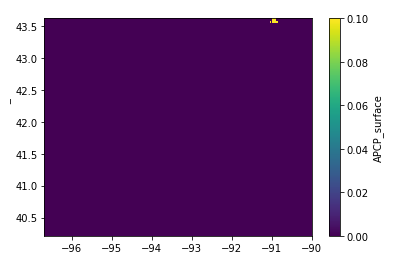
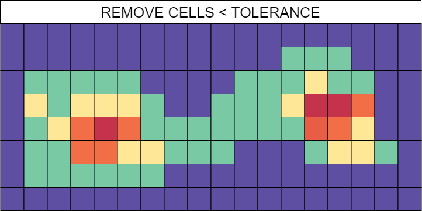
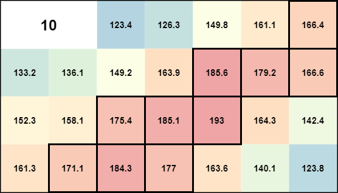
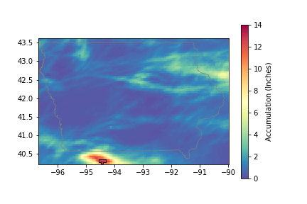
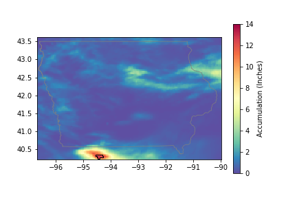
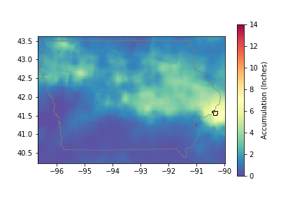
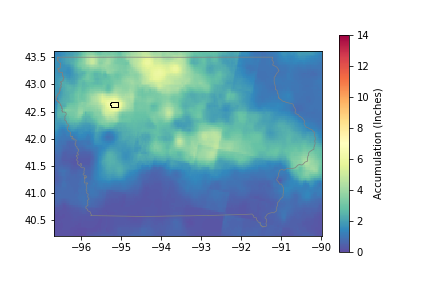
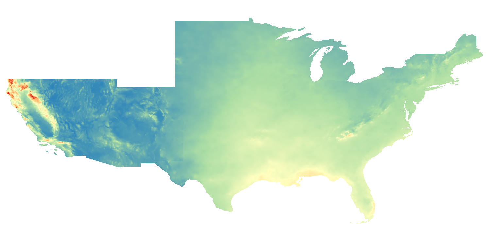

# workflow

Sandbox for downloading, analyzing, and cataloging historic storm data for use in Stochastic Storm Transposition (SST).

The data download and analysis pipelines leverage both a PostgreSQL database and Python libraries to identify storm events and create visual documents for cataloging these events. React and Meilisearch are utilized to serve these documents as a catalog with search engine capabilities.

---

## Data Source

For the development environment, historic precipitation data for the North Central River Forecast Center was gathered from the AORC file server. This dataset consisted of 40-years of monthly zipped folders containing hourly NetCDF files. Each NetCDF had 343,500 grid cells (4KM x 4 KM) with precipitation given in mm. These zip files were downloaded and extracted to an EC2 instance with database tables logging the inventory.

---

## Workflow

Inputs used for the development workflow:

- Transposition Area = buffered Iowa bounding box
- Duration = 72 hours
- Storm area = 16 cells (~ 99 sq miles)

Available AORC data = 02/02/1979 - 05/31/2022

### ***Mask & Sum NetCDFs***

For the entire 40-yr dataset, a sliding 72-hr window was applied to the entire 40-yr dataset (start time limited to only midnight in order to reduce # of windows). 

- 1979-02-02 00:00:00 -> 1979-02-04 23:00:00
- 1979-02-03 00:00:00 -> 1979-02-05 23:00:00
- etc...
- 2022-05-28 00:00:00 -> 2022-05-30 23:00:00
- 2022-05-29 00:00:00 -> 2022-05-31 23:00:00

For a given window, netcdfs between the start and end times were loaded, masked by the transposition area, and summed.

### ***Calculate Threshold & Exclude Cells***

For each summed window, a threshold was calculated based on the target of 16 cells. There are a total of 20,502 cells within the Iowa transposition area, so 16 is slightly less than .1% of the cells in Iowa (in other words, the 99.9th percentile). Using this information, all cells with a value less than ~ 99.9th percentile can INITIALLY be excluded from clustering (more on adding excluded cells below). For each window, a custom function was used to provide the exact percentile and threshold that would ideally remove all but 16 cells.

**NOTE:** 
In some cases, all or nearly all cells have very low precipitation values and there is not enough variance in these values. This leads to very few cells actually being excluded and significantly slows down the remaining steps. For development purposes, these cases were ignored by skipping extremely large clusters (determined by number of cells in a cluster). *An example of one such case is provided below where < 16 cells have a maximum precipitation of .1 mm so automatically applying the threshold of 99.9th percentile does not filter any of the cells.*

*A more elegant, statistically-based solution will be developed for the final methodology to determine/ignore these cases.*

### ***Cluster Cells***

The desired outcome was to identify an amorphous ~95 sq mile area that had the largest average accumulation. After removing cells with precip < threshold, the remaining cells were clustered. Using density-based clustering (dbscan) with a epsilon value of 1.5, only points directly adjacent to each other would be clustered.

In ideal cases, the calculated threshold will leave a single cluster of cells that is exactly equal to the target size (this occurred ~25% of the time).

In other cases, there were multiple clusters and/or clusters that did not match the target size. For these cases, each cluster would either iteratively add or remove a single cell until it matched the target size. Finally, all the clusters for the given window were compared and the area with the greatest average accumulation was identified as a storm and inserted into the database.

#### **Adding cells**

The adjacent cell with the largest accumulation is chosen because that would be the best cell to make the average accumulation as large as possible (while maintaining a continuous shape)

#### **Removing cells**

The cell with the smallest accumulation (only considering cells touching the edge of the shape) was chosen. In few cases, this led to the shape becoming disconnected. If the cluster became disconnected, the disconnected clusters were added back into the processing pool as two seperate clusters where the add/removing process was applied.

### ***Select Top 10 Storms per Year***

The storm data is stored in the database, allowing for quick and easy retrieval of storms for a given year ordered by accumulation. This allows the retrieval function to be parameterized to return N storms ordered by any criteria (e.g., max accumulation or average accumulation). 

#### **Date declustering**

Typically, the query would just include a LIMIT to return N storms. However, this would lead to double counting what is essentially the same storm because the 72 hour duration is longer than the 24 hour step for the storm identification process. Instead, the results of the query are iterated and added to a list, returning after N storms are added. A storm will be skipped if there is any temporal overlap with a storm already existing in the list (the overlap is determined using the start time and duration).

*2017-06-28 (72 hours)*

*2017-06-29 (72 hours)*

*There likely needs to also be some sort of spatial check added when dealing with large transposition areas like Iowa. The two storms below appear like different events but only one could be included with the current implementation of the date declustering*

*1979-08-18 (72 hours)*

*1979-08-19 (72 hours)*

### 2-yr Normalization

[NOAA Atlas-14 percipitation frequency estimates](https://hdsc.nws.noaa.gov/hdsc/pfds/pfds_gis.html) were used to normalize the average accumulation for each storm. The PFE rasters (72-hr duration / 2-yr average recurrence interval) for each region were merged into a single raster.

 Due to differences in resolution, 16 PFE cells fell within each AORC cell. For each of the 16 cells comprising a storm, the 16 PFE cells were averaged and the AORC value was divided by that mean value. These normalized values were then averaged again to give a normalized average for each storm.

